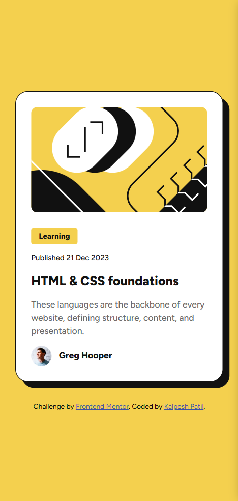
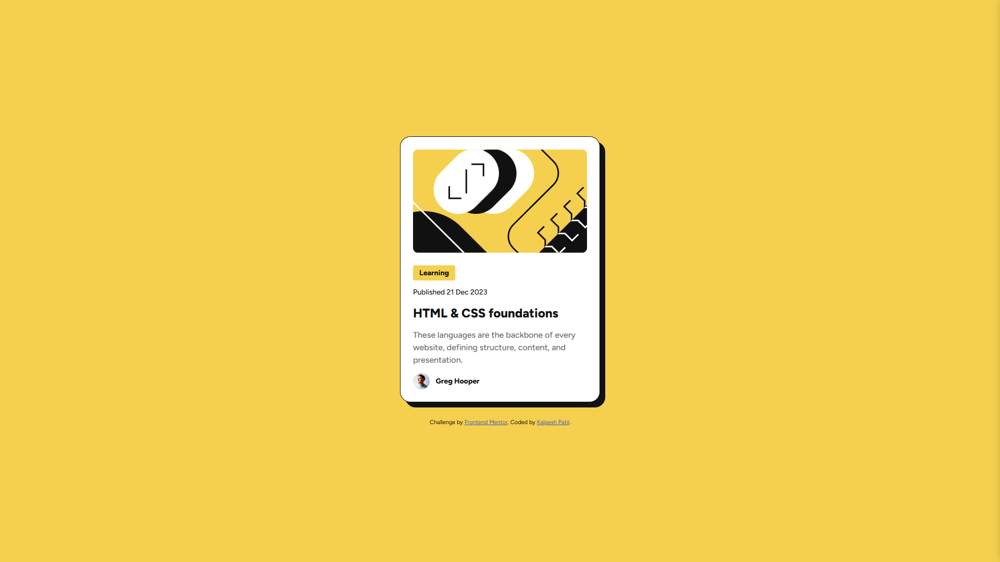

# Frontend Mentor - Blog preview card solution

This is a solution to the [Blog preview card challenge on Frontend Mentor](https://www.frontendmentor.io/challenges/blog-preview-card-ckPaj01IcS). Frontend Mentor challenges help you improve your coding skills by building realistic projects. 

## Table of contents

- [Overview](#overview)
  - [The challenge](#the-challenge)
  - [Screenshot](#screenshot)
  - [Links](#links)
- [My process](#my-process)
  - [Built with](#built-with)
  - [What I learned](#what-i-learned)
  - [Continued development](#continued-development)
- [Author](#author)


## Overview

### The challenge

- Solution should look close to the design.
- Title of the Blog needs to have active effect.
- Solution should be responsive for all sorts of screen sizes.


### Screenshot





### Links

- Solution URL: [Solution URL](https://your-solution-url.com)
- Live Site URL: [Live site URL](https://your-live-site-url.com)

## My process

### Built with

- Semantic HTML5 markup
- CSS custom properties
- Flexbox
- Mobile-first workflow
- Media querries. 

### What I learned

In this problem I learned how to use media querries to make your design more responsive. It is one step ahead of using the units that scale with the screen and browser settings.

```css
@media only screen and (max-width: 380px) {
    .card-tag,
    .card-date {
        font-size: 1.2rem;
    }

    .card-title {
        font-size: 2rem;
    }

    .card-desc {
        font-size: 1.4rem;
    }
}
```

### Continued development

For now I dont see any way i can improve this design. If you have any improvements do let me know. 

## Author
- Frontend Mentor - [@kalpesh172000](https://www.frontendmentor.io/profile/kalpesh172000)
